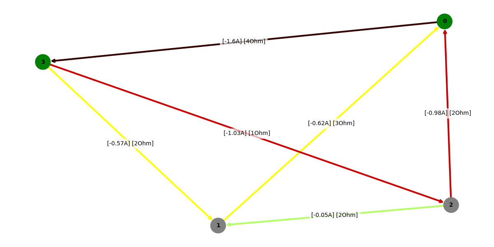
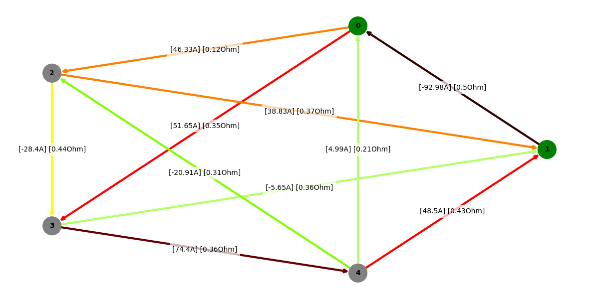
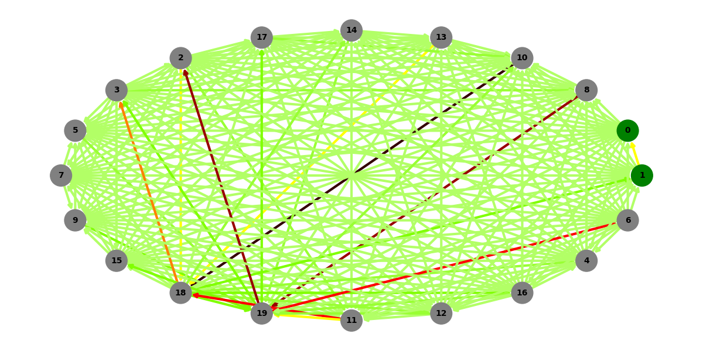
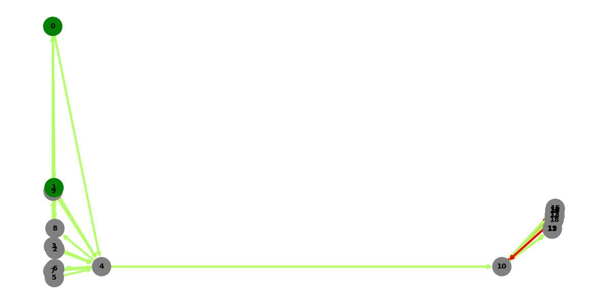
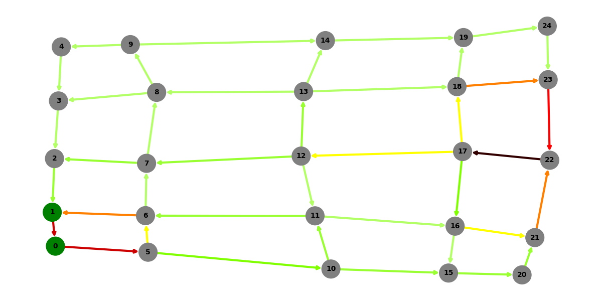
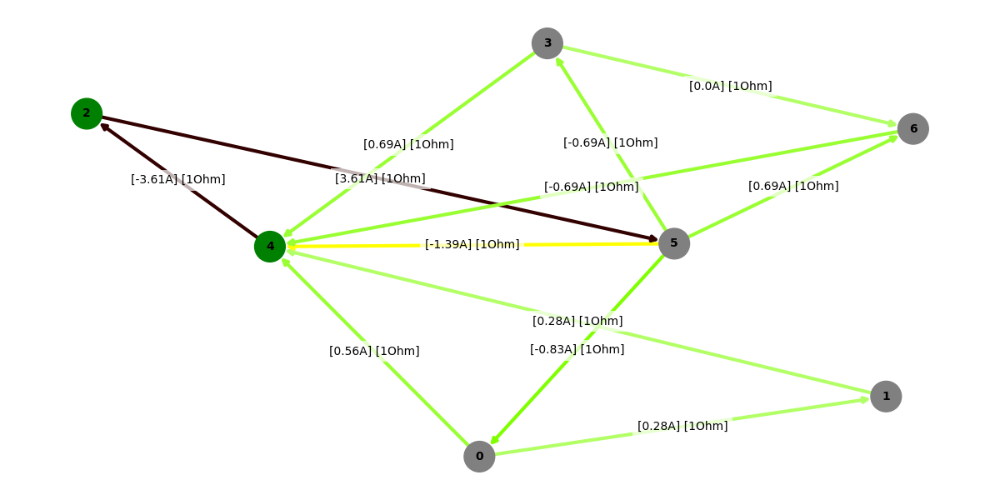
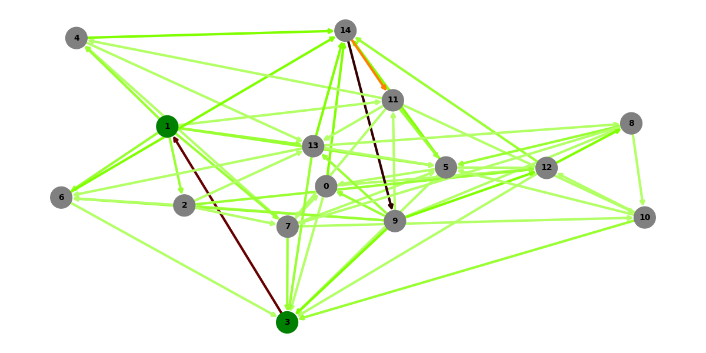

<font size="6">
Solving Electric Circuit
</font>
<br>

This project is a simple implementation of solving electric circuits using Kirchhoff's laws and solving the resulting system of equations. The project is written in Python and uses the numpy library for matrix operations.

Steps to solve the circuit:
<ol>
<li>Switching to adjacency list representation</li>
<li>Finding edge with the voltage attached to it</li>
<li>Fill matrix A and vector B using I & II Kirchhoff's law</li>
<li>Solve a linear matrix equation</li>
</ol> 


__1. Switching to adjacency list representation:__
```python
def switch_to_list_representation(edges):
    graph_dict = {}

    for edge in edges:
        s,t,weight = edge
        if s not in graph_dict:
            graph_dict[s] = []
        if t not in graph_dict:
            graph_dict[t] = []
        graph_dict[s].append((t,weight))
        graph_dict[t].append((s,weight))
        

    G = [[] for _ in range(len(graph_dict))]

    for s,edges in graph_dict.items():
        for edge in edges:
            G[s].append(edge)

    return G
```

__2. Finding edge with the voltage attached to it:__
Function returns index of edge with voltage attached to it. If there is no such edge, it returns -1.
```python
def find_edge_with_voltage(edges,s,t):
    for i in range(len(edges)):
        if (edges[i][0] == s and edges[i][1] == t) or (edges[i][0] == t and edges[i][1] == s):
            return i
    return -1

```

__3.Fill matrix A and vector B using I & II Kirchhoff's law:__
This is the example of edges list:
```python
edges = [(0,1,3),
        (1,2,2),
        (2,3,1),
        (3,0,4),
        (0,2,2),
        (1,3,2)]
```
Matrix A and vector B:
```python
A = [[0.0 for _ in range(e)] for _ in range(e)]
B = [0.0 for _ in range(e)]
```

Using I Kirchhoff's law:
```python
for i in range(v-1):
        for j in range(e):
            if edges[j][0] == i:
                A[i][j] = -1
            elif edges[j][1] == i:
                A[i][j] = 1
```
If vertex i is the source of the edge, then the value in matrix A is -1. If vertex i is the target of the edge, then the value in matrix A is 1.

For using II Kirchhoff's law we will have to find unique cycles in the graph.
```python

def find_cycle(graph, start, end):
    visited = [0 for _ in range(len(graph))]
    visited[start] = 1
    stack = [(start,[start])]

    while stack:
        u,path = stack.pop()
        
        for v,weight in graph[u]:
            if v == end:
                return path + [v]
            
            elif not visited[v]:
                    visited[v] = 1
                    stack.append((v,path + [v]))
    return None

# checking if the cycle has already occurred
def is_duplicate(cycle,cycles):
    for c in cycles:
        if set(c) == set(cycle):
            return True
    return False

def find_n_cycles(edges,G,n):
    edges_cp = deepcopy(edges)
    graph = deepcopy(G)

    cycles = []

    cnt_cycles = 0

    for _ in range(n):

        #choosing edge
        #wybieramy krawedz
        for u,v,weight in edges_cp:

            #temporarily remove edge
            #chwilowo ja usuwamy
            graph[u].remove((v,weight))
            graph[v].remove((u,weight))
            
            # finding a path between two vertices
            # znajdujemy sciezke pomiedzy tymi dwoma wierzcholkami
            cycle = find_cycle(graph,u,v)

            #if the cycle exists and has not been added before, we add it
            #jesli cykl istnieje i nie byl wczesniej dodany to go dodajemy
            if cycle:
                if not is_duplicate(cycle,cycles):
                    cycles.append(cycle)    
                    cnt_cycles += 1
            
            #restoring the edge
            #przywracamy krawedz
            graph[u].append((v,weight))
            graph[v].append((u,weight))

            if cnt_cycles == n:
                return cycles

    return cycles

#function to switch from cycle representation to egde represantation that shows direction of edge
def get_edges(edges,cycle):
    new_edges = []
    for i in range(1,len(cycle)):
        u = cycle[i-1]
        v = cycle[i]
        for j in range(len(edges)):
            if (u,v) == (edges[j][0],edges[j][1]):
                new_edges.append((j,1))
                break

            if (v,u) == (edges[j][0],edges[j][1]):
                new_edges.append((j,-1))
                break
                
    u = cycle[-1]
    v = cycle[0]
    for j in range(len(edges)):
        if (u,v) == (edges[j][0],edges[j][1]):
            new_edges.append((j,1))
            break

        if (v,u) == (edges[j][0],edges[j][1]):
            new_edges.append((j,-1))
            break

    return new_edges    
```
Finally, we can fill matrix A and vector B using II Kirchhoff's law:
```python
cycles = find_n_cycles(edges,G,e-v+1)

    i = v-1
    for cycle in cycles:
        curr_edges = get_edges(edges,cycle)
        for index,direction in curr_edges:
            if index == edge_with_voltage:
                if direction == 1:
                    B[i] -= E
                else:
                    B[i] += E
            else:
                if direction == 1:
                    A[i][index] += edges[index][2]
                else:
                    A[i][index] -= edges[index][2]
        i += 1
```
If our edge is in the cycle and the direction of the edge is the same as the direction of the cycle, then we add the value of the edge to the matrix A. If the direction of the edge is opposite to the direction of the cycle, then we subtract the value of the edge from the matrix A. If the edge is the edge with the voltage attached to it, then we add or subtract the value of the voltage to the vector B depending on the direction of the edge in the cycle.


__4. Solve a linear matrix equation:__
```python
A_np = np.array(A)
B_np = np.array(B)

return np.linalg.solve(A_np,B_np)
```

Whole source code for solving the circuit aswell as creating graph visualizations is in the file [prad.py](./prad.py)


First graph - testing if it works properly:
```python
graph_test(0,3,Layout.SPRING,True)
```



Second graph - regular connected graph:
```python
random_regular_graph_test(5,0,1,Layout.CIRCULAR,True)
```



For larger graphs, you need to turn off the labels to not limit visibility:
```python
random_regular_graph_test(20,0,1,Layout.CIRCULAR)
```


Graph with a bridge:
```python
random_bridge_graph_test(20,0,1,Layout.SPECTRAL)
```


2D grid graph:
```python
random_grid_graph_test(5,5,0,1,Layout.SPECTRAL)
```


Random graph - 1:
```python
random_graph_test(7,2,4,Layout.SPRING,True)
```


Random graph - 2:
```python
random_graph_test(15,1,3,Layout.SPRING)
```

