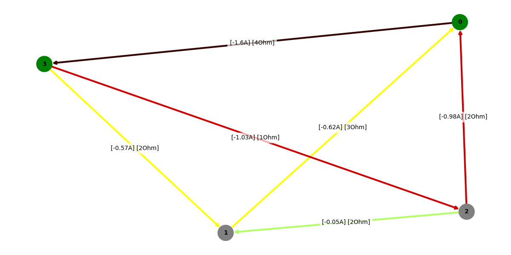
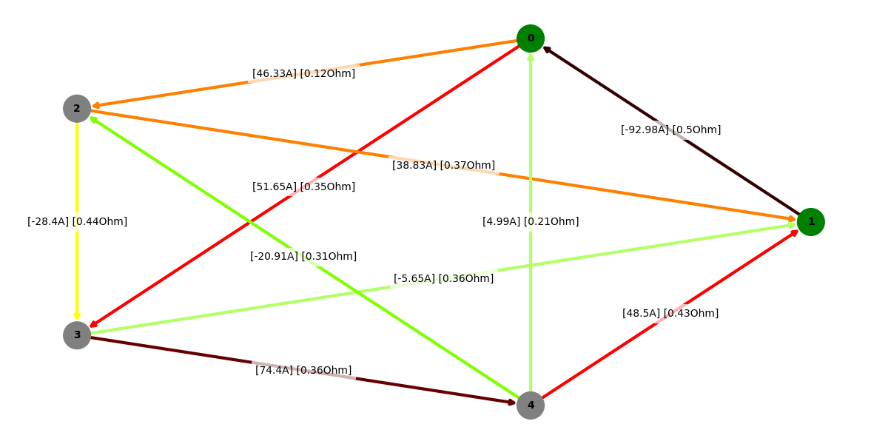
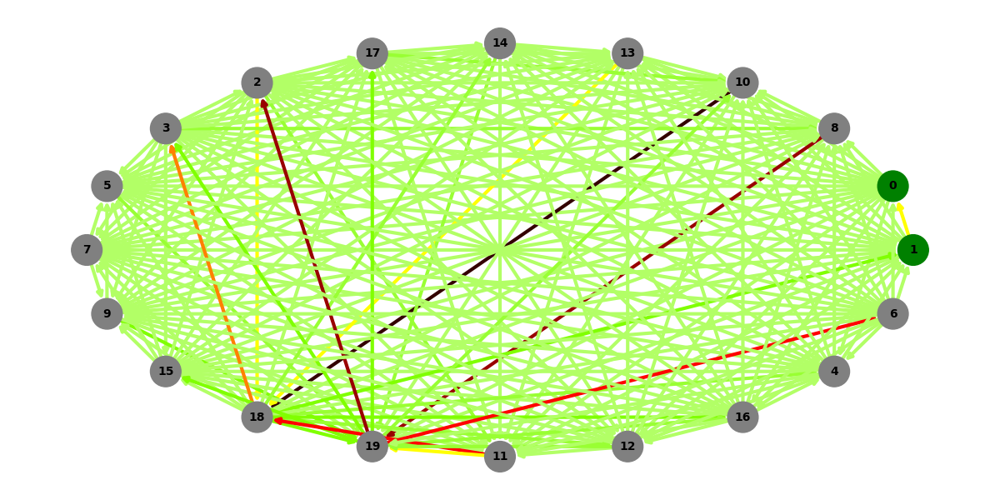
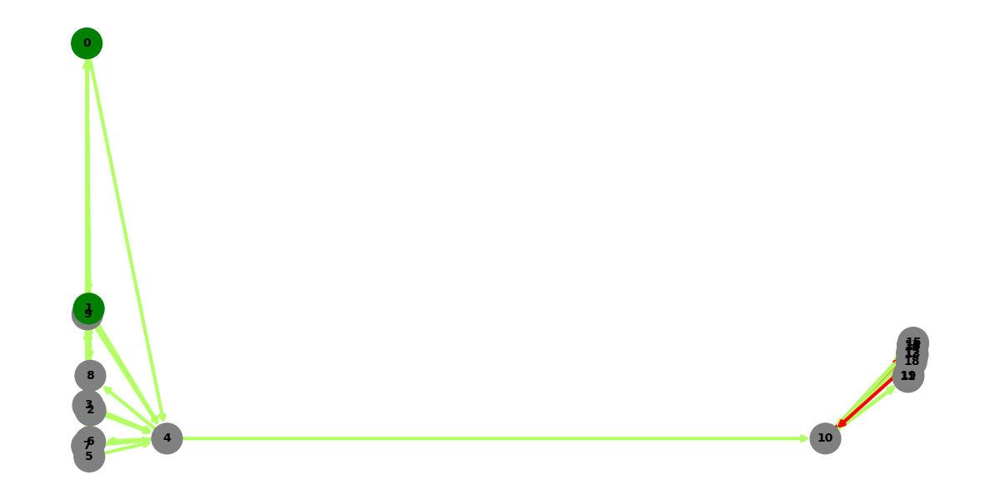
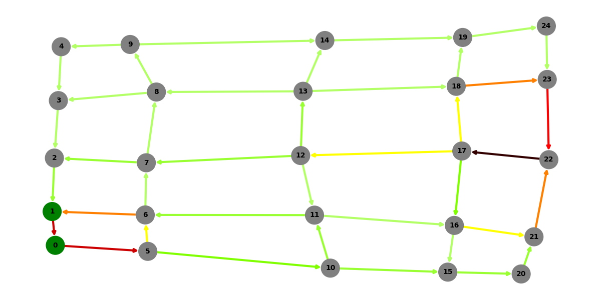
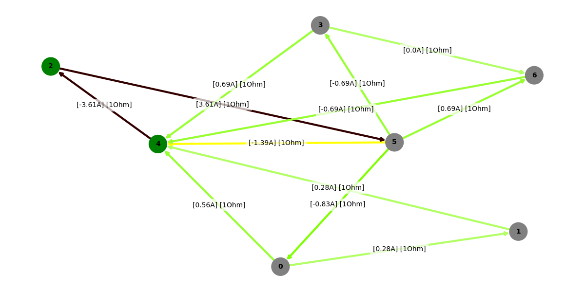
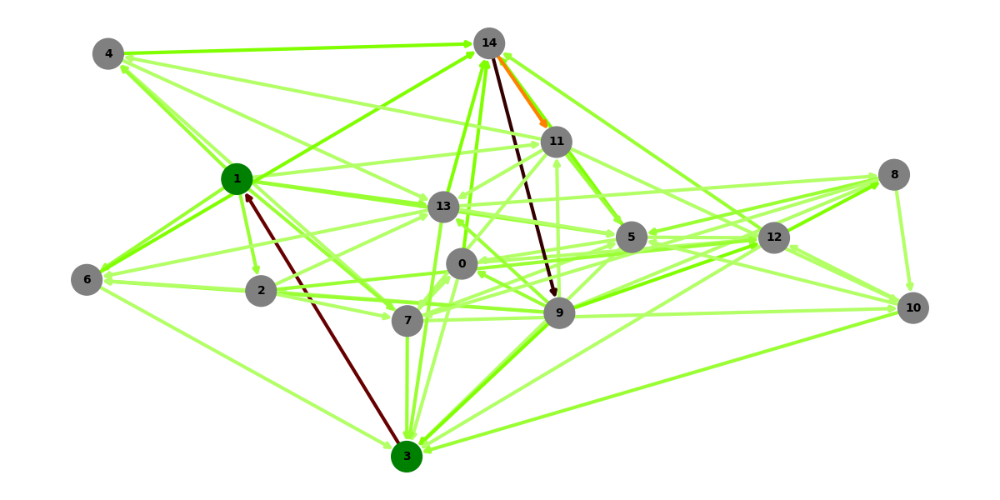

<font size="6">
Solving Electric Circuit
</font>
<br>

This project is a simple implementation of solving electric circuits using Kirchhoff's laws and solving the resulting system of equations. The project is written in Python and uses the numpy library for matrix operations.

First graph - testing if it works properly:
```python
graph_test(0,3,Layout.SPRING,True)
```



Second graph - regular connected graph:
```python
random_regular_graph_test(5,0,1,Layout.CIRCULAR,True)
```



For larger graphs, you need to turn off the labels to not limit visibility:
```python
random_regular_graph_test(20,0,1,Layout.CIRCULAR)
```


Graph with a bridge:
```python
random_bridge_graph_test(20,0,1,Layout.SPECTRAL)
```


2D grid graph:
```python
random_grid_graph_test(5,5,0,1,Layout.SPECTRAL)
```


Random graph - 1:
```python
random_graph_test(7,2,4,Layout.SPRING,True)
```


Random graph - 2:
```python
random_graph_test(15,1,3,Layout.SPRING)
```

