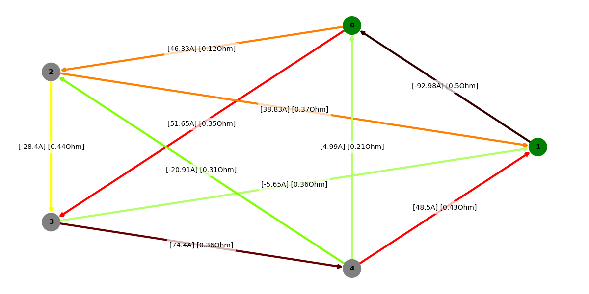
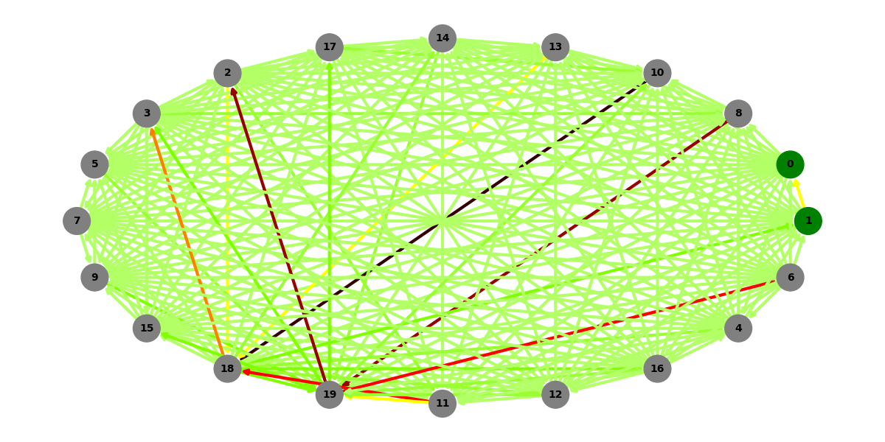

ZADANIE 1 - METODA GAUSSA-JORDANA
FUNKCJA GAUSSA:
```python
import numpy as np
def gauss(A,B):
    n = len(A)

    if len(A) != len(A[0]):
        raise ValueError("Macierz A musi być kwadratowa")

    if len(A) != len(B):
        raise ValueError("Macierz A i B muszą mieć tyle samo wierszy")

    np_aug_matrix = np.column_stack((A,B))

    aug_matrix = np_aug_matrix.tolist()

    for i in range(n):
        max_row = i

        #finding biggeset element in column (element wiodący)
        for j in range(i,n):
            if(abs(aug_matrix[j][i]) > abs(aug_matrix[max_row][i])):
                max_row = j

        #switching rows
        aug_matrix[i], aug_matrix[max_row] = aug_matrix[max_row], aug_matrix[i]

        #pivot is an element on the main diagonal
        pivot = aug_matrix[i][i]

        #dividing row by pivot so that the eleemnt on diagonal would be equal to 1
        for j in range(i, n + 1):
            aug_matrix[i][j] /= pivot
        
        #substracting rows from row with pivot
        for j in range(i+1,n):
            tmp = aug_matrix[j][i]
            for k in range(i,n+1):
                aug_matrix[j][k] -= tmp * aug_matrix[i][k]


    #backward substitution
    for i in range(n-1,-1,-1):
        for j in range(i-1,-1,-1):
            tmp = aug_matrix[j][i]
            for k in range(i,n+1):
                aug_matrix[j][k] -= tmp * aug_matrix[i][k]

    #wyciagnięcie wyników z augmented matrix

    x = [row[n] for row in aug_matrix]       
    
    
    return x
```


TESTOWANIE:
```python
import unittest
import numpy as np
from gaus_jordan import gauss
import time
import scipy.linalg as la

class TestGauss(unittest.TestCase):
    
    def test_0(self):
        n = 500
        np.random.seed(0)
        A = np.random.rand(n,n)*100
        B = np.random.rand(n)*100

        start_time = time.time()

        X = gauss(A,B)

        end_time = time.time()
        print("\nTest 1:")
        print("Czas wykonania: ", end_time - start_time)

        start_time = time.time()

        Y = np.linalg.solve(A,B)
        """ Y = np.linalg.lstsq(A2,B2,rcond=None) """
        """ Y = la.solve(A2,B2) """

        end_time = time.time()
        print("Czas wykonania: ", end_time - start_time)    

        for i in range(n):
            X[i] = round(X[i],2)
            Y[i] = round(Y[i],2)
        self.assertEqual(list(Y), list(X))


    def test_1(self):
        n = 550
        np.random.seed(10)
        A = np.random.rand(n,n)*100
        B = np.random.rand(n)*100

        start_time = time.time()

        X = gauss(A,B)

        end_time = time.time()
        print("\nTest 2:")
        print("Czas wykonania: ", end_time - start_time)

        start_time = time.time()

        Y = np.linalg.solve(A,B)
        """ Y = np.linalg.lstsq(A2,B2,rcond=None) """
        """ Y = la.solve(A2,B2) """

        end_time = time.time()
        print("Czas wykonania: ", end_time - start_time)    
        for i in range(n):
            X[i] = round(X[i],2)
            Y[i] = round(Y[i],2)
        self.assertEqual(list(Y), list(X))

    def test_2(self):
        n = 600
        np.random.seed(20)
        A = np.random.rand(n,n)*100
        B = np.random.rand(n)*100

        start_time = time.time()

        X = gauss(A,B)

        end_time = time.time()
        print("\nTest 3:")
        print("Czas wykonania: ", end_time - start_time)

        start_time = time.time()

        Y = np.linalg.solve(A,B)
        """ Y = np.linalg.lstsq(A2,B2,rcond=None) """
        """ Y = la.solve(A2,B2) """

        end_time = time.time()
        print("Czas wykonania: ", end_time - start_time)    
        for i in range(n):
            X[i] = round(X[i],2)
            Y[i] = round(Y[i],2)
        self.assertEqual(list(Y), list(X))
    
    def test_3(self):
        n = 650
        np.random.seed(30)
        A = np.random.rand(n,n)*100
        B = np.random.rand(n)*100

        start_time = time.time()

        X = gauss(A,B)

        end_time = time.time()
        print("\nTest 4:")
        print("Czas wykonania: ", end_time - start_time)

        start_time = time.time()

        Y = np.linalg.solve(A,B)
        """ Y = np.linalg.lstsq(A2,B2,rcond=None) """
        """ Y = la.solve(A2,B2) """

        end_time = time.time()
        print("Czas wykonania: ", end_time - start_time)    
        for i in range(n):
            X[i] = round(X[i],2)
            Y[i] = round(Y[i],2)
        self.assertEqual(list(Y), list(X))
    
    def test_4(self):
        n = 700
        np.random.seed(40)
        A = np.random.rand(n,n)*100
        B = np.random.rand(n)*100

        start_time = time.time()

        X = gauss(A,B)

        end_time = time.time()
        print("\nTest 5:")
        print("Czas wykonania: ", end_time - start_time)

        start_time = time.time()

        Y = np.linalg.solve(A,B)
        """ Y = np.linalg.lstsq(A2,B2,rcond=None) """
        """ Y = la.solve(A2,B2) """

        end_time = time.time()
        print("Czas wykonania: ", end_time - start_time)    
        for i in range(n):
            X[i] = round(X[i],2)
            Y[i] = round(Y[i],2)
        self.assertEqual(list(Y), list(X))
    
    def test_5(self):
        n = 750
        np.random.seed(50)
        A = np.random.rand(n,n)*100
        B = np.random.rand(n)*100

        start_time = time.time()

        X = gauss(A,B)

        end_time = time.time()
        print("\nTest 6:")
        print("Czas wykonania: ", end_time - start_time)

        start_time = time.time()

        Y = np.linalg.solve(A,B)
        """ Y = np.linalg.lstsq(A2,B2,rcond=None) """
        """ Y = la.solve(A2,B2) """

        end_time = time.time()
        print("Czas wykonania: ", end_time - start_time)    
        for i in range(n):
            X[i] = round(X[i],2)
            Y[i] = round(Y[i],2)
        self.assertEqual(list(Y), list(X))

    def test_6(self):
        n = 800
        np.random.seed(60)
        A = np.random.rand(n,n)*100
        B = np.random.rand(n)*100

        start_time = time.time()

        X = gauss(A,B)

        end_time = time.time()
        print("\nTest 7:")
        print("Czas wykonania: ", end_time - start_time)

        start_time = time.time()

        Y = np.linalg.solve(A,B)
        """ Y = np.linalg.lstsq(A2,B2,rcond=None) """
        """ Y = la.solve(A2,B2) """

        end_time = time.time()
        print("Czas wykonania: ", end_time - start_time)    
        for i in range(n):
            X[i] = round(X[i],2)
            Y[i] = round(Y[i],2)
        self.assertEqual(list(Y), list(X))

    def test_7(self):
        n = 850
        np.random.seed(70)
        A = np.random.rand(n,n)*100
        B = np.random.rand(n)*100

        start_time = time.time()

        X = gauss(A,B)

        end_time = time.time()
        print("\nTest 8:")
        print("Czas wykonania: ", end_time - start_time)

        start_time = time.time()

        Y = np.linalg.solve(A,B)
        """ Y = np.linalg.lstsq(A2,B2,rcond=None) """
        """ Y = la.solve(A2,B2) """

        end_time = time.time()
        print("Czas wykonania: ", end_time - start_time)    
        for i in range(n):
            X[i] = round(X[i],2)
            Y[i] = round(Y[i],2)
        self.assertEqual(list(Y), list(X))

    def test_8(self):
        n = 900
        np.random.seed(80)
        A = np.random.rand(n,n)*100
        B = np.random.rand(n)*100

        start_time = time.time()

        X = gauss(A,B)

        end_time = time.time()
        print("\nTest 9:")
        print("Czas wykonania: ", end_time - start_time)

        start_time = time.time()

        Y = np.linalg.solve(A,B)
        """ Y = np.linalg.lstsq(A2,B2,rcond=None) """
        """ Y = la.solve(A2,B2) """

        end_time = time.time()
        print("Czas wykonania: ", end_time - start_time)    
        for i in range(n):
            X[i] = round(X[i],2)
            Y[i] = round(Y[i],2)
        self.assertEqual(list(Y), list(X))

    def test_9(self):
        n = 950
        np.random.seed(90)
        A = np.random.rand(n,n)*100
        B = np.random.rand(n)*100

        start_time = time.time()

        X = gauss(A,B)

        end_time = time.time()
        print("\nTest 10:")
        print("Czas wykonania: ", end_time - start_time)

        start_time = time.time()

        Y = np.linalg.solve(A,B)
        """ Y = np.linalg.lstsq(A2,B2,rcond=None) """
        """ Y = la.solve(A2,B2) """

        end_time = time.time()
        print("Czas wykonania: ", end_time - start_time)    
        for i in range(n):
            X[i] = round(X[i],2)
            Y[i] = round(Y[i],2)
        self.assertEqual(list(Y), list(X))


if __name__ == '__main__':
    unittest.main()
```
```
Test 1:
Czas wykonania:  6.636320352554321
Czas wykonania:  0.011871576309204102
.
Test 2:
Czas wykonania:  9.226516723632812
Czas wykonania:  0.03959345817565918
.
Test 3:
Czas wykonania:  13.697162389755249
Czas wykonania:  0.06762909889221191
.
Test 4:
Czas wykonania:  18.738160371780396
Czas wykonania:  0.052736520767211914
.
Test 5:
Czas wykonania:  23.643938779830933
Czas wykonania:  0.6917181015014648
.
Test 6:
Czas wykonania:  28.158957958221436
Czas wykonania:  0.08131814002990723
.
Test 7:
Czas wykonania:  34.36442804336548
Czas wykonania:  0.08459925651550293
.
Test 8:
Czas wykonania:  41.398422956466675
Czas wykonania:  1.0669920444488525
.
Test 9:
Czas wykonania:  50.04830074310303
Czas wykonania:  0.10084128379821777
.
Test 10:
Czas wykonania:  53.00654339790344
Czas wykonania:  0.2259984016418457
.
```

ZADANIE 2 - FAKTORYZACJA LU
FUNKCJA LU:
```python
def make_U_and_L(A):
    n = len(A)

    # tworzenie macierzy U z A
    for i in range(n):
        pivot_A = A[i][i]
        
        for j in range(i+1,n):
            tmp_A= A[j][i]
            # wpisanie współczynnika macierzy L
            for k in range(i,n):
                A[j][k] -= tmp_A * (A[i][k]/pivot_A)
            A[j][i] = tmp_A/pivot_A
                
    return A

```
TESTOWANIE:
```python
import unittest
import numpy as np
from faktoryzacja import make_U_and_L
import copy as cp

class TestFactor(unittest.TestCase):

    def test_0(self):
        A = [[5,3,2],[1,2,0],[3,0,4]]

        A = make_U_and_L(A)

        U = [[0 for _ in range(len(A))] for _ in range(len(A))]

        for i in range(len(A)):
            for j in range(i,len(A)):
                U[i][j] = A[i][j]

        np_U = np.array(U)

        L = [[0 for _ in range(len(A))] for _ in range(len(A))]
        for i in range(len(A)):
            for j in range(0,i+1):
                if i == j:
                    L[i][j] = 1
                else:
                    L[i][j] = A[i][j]
            
        np_L = np.array(L)

        A_np = np.dot(np_L,np_U)

        A = [[5,3,2],[1,2,0],[3,0,4]]

        B = [[abs(A[i][j]-A_np[i][j]) for j in range(len(A))]for i in range(len(A))]

        for i in range(len(B)):
            for j in range(len(B)):
                self.assertAlmostEqual(B[i][j],0)
            

    def test_1(self):
        A = [[0 for _ in range(100)] for _ in range(100)]
        for i in range(100):
            for j in range(100):
                A[i][j] = np.random.randint(0,100)

        A_t = cp.deepcopy(A)
        A = make_U_and_L(A)

        U = [[0 for _ in range(len(A))] for _ in range(len(A))]

        for i in range(len(A)):
            for j in range(i,len(A)):
                U[i][j] = A[i][j]

        np_U = np.array(U)

        L = [[0 for _ in range(len(A))] for _ in range(len(A))]
        for i in range(len(A)):
            for j in range(0,i+1):
                if i == j:
                    L[i][j] = 1
                else:
                    L[i][j] = A[i][j]
            

        np_L = np.array(L)

        A_np = np.dot(np_L,np_U)

        A = [[5,3,2],[1,2,0],[3,0,4]]

        B = [[abs(A_t[i][j]-A_np[i][j]) for j in range(len(A))]for i in range(len(A))]

        for i in range(len(B)):
            for j in range(len(B)):
                self.assertAlmostEqual(B[i][j],0)


    def test_2(self):
        A = [[0 for _ in range(100)] for _ in range(100)]
        for i in range(100):
            for j in range(100):
                A[i][j] = np.random.randint(0,100)

        A_t = cp.deepcopy(A)
        A = make_U_and_L(A)

        U = [[0 for _ in range(len(A))] for _ in range(len(A))]

        for i in range(len(A)):
            for j in range(i,len(A)):
                U[i][j] = A[i][j]

        np_U = np.array(U)

        L = [[0 for _ in range(len(A))] for _ in range(len(A))]
        for i in range(len(A)):
            for j in range(0,i+1):
                if i == j:
                    L[i][j] = 1
                else:
                    L[i][j] = A[i][j]
            

        np_L = np.array(L)

        A_np = np.dot(np_L,np_U)

        A = [[5,3,2],[1,2,0],[3,0,4]]

        B = [[abs(A_t[i][j]-A_np[i][j]) for j in range(len(A))]for i in range(len(A))]

        for i in range(len(B)):
            for j in range(len(B)):
                self.assertAlmostEqual(B[i][j],0)


    def test_3(self):
        A = [[0 for _ in range(100)] for _ in range(100)]
        for i in range(100):
            for j in range(100):
                A[i][j] = np.random.randint(0,100)

        A_t = cp.deepcopy(A)
        A = make_U_and_L(A)

        U = [[0 for _ in range(len(A))] for _ in range(len(A))]

        for i in range(len(A)):
            for j in range(i,len(A)):
                U[i][j] = A[i][j]

        np_U = np.array(U)

        L = [[0 for _ in range(len(A))] for _ in range(len(A))]
        for i in range(len(A)):
            for j in range(0,i+1):
                if i == j:
                    L[i][j] = 1
                else:
                    L[i][j] = A[i][j]
            

        np_L = np.array(L)

        A_np = np.dot(np_L,np_U)

        A = [[5,3,2],[1,2,0],[3,0,4]]

        B = [[abs(A_t[i][j]-A_np[i][j]) for j in range(len(A))]for i in range(len(A))]

        for i in range(len(B)):
            for j in range(len(B)):
                self.assertAlmostEqual(B[i][j],0)


    def test_4(self):
        A = [[0 for _ in range(100)] for _ in range(100)]
        for i in range(100):
            for j in range(100):
                A[i][j] = np.random.randint(0,100)

        A_t = cp.deepcopy(A)
        A = make_U_and_L(A)

        U = [[0 for _ in range(len(A))] for _ in range(len(A))]

        for i in range(len(A)):
            for j in range(i,len(A)):
                U[i][j] = A[i][j]

        np_U = np.array(U)

        L = [[0 for _ in range(len(A))] for _ in range(len(A))]
        for i in range(len(A)):
            for j in range(0,i+1):
                if i == j:
                    L[i][j] = 1
                else:
                    L[i][j] = A[i][j]
            

        np_L = np.array(L)

        A_np = np.dot(np_L,np_U)

        A = [[5,3,2],[1,2,0],[3,0,4]]

        B = [[abs(A_t[i][j]-A_np[i][j]) for j in range(len(A))]for i in range(len(A))]

        for i in range(len(B)):
            for j in range(len(B)):
                self.assertAlmostEqual(B[i][j],0)


    def test_5(self):
        A = [[0 for _ in range(100)] for _ in range(100)]
        for i in range(100):
            for j in range(100):
                A[i][j] = np.random.randint(0,100)

        A_t = cp.deepcopy(A)
        A = make_U_and_L(A)

        U = [[0 for _ in range(len(A))] for _ in range(len(A))]

        for i in range(len(A)):
            for j in range(i,len(A)):
                U[i][j] = A[i][j]

        np_U = np.array(U)

        L = [[0 for _ in range(len(A))] for _ in range(len(A))]
        for i in range(len(A)):
            for j in range(0,i+1):
                if i == j:
                    L[i][j] = 1
                else:
                    L[i][j] = A[i][j]
            

        np_L = np.array(L)

        A_np = np.dot(np_L,np_U)

        A = [[5,3,2],[1,2,0],[3,0,4]]

        B = [[abs(A_t[i][j]-A_np[i][j]) for j in range(len(A))]for i in range(len(A))]

        for i in range(len(B)):
            for j in range(len(B)):
                self.assertAlmostEqual(B[i][j],0)


if __name__ == '__main__':
    unittest.main()

```
```
Ran 6 tests in 0.383s

OK
```

ZADANIE 3 - ROZWIĄZANIE UKŁADU ELEKTRYCZNEGO ZA POMOCĄ PRAW KIRCHOFFA I UKLADU RÓWNAŃ MACIERZOWEGO


Importy i enum przydatny do rysowania grafów:
```python
from copy import deepcopy
import numpy as np
import matplotlib.pyplot as plt
import networkx as nx
from graph_generator import generating_random_graph, generating_random_bridge_graph, generating_random_grid_graph
from enum import Enum

class Layout(Enum):
    SPRING = 1
    SPECTRAL = 1
    CIRCULAR = 3
    SPIRAL = 4
    RANDOM = 5

```
Zamiana na reprezentację listy sąsiedztwa:
Robię to ponieważ w tej reprezentacji łatwiej mi będzie znaleźć cykle w grafie.
```python
# reprezentacja grafu w postaci listy sasiedztwa
def switch_to_list_representation(edges):
    graph_dict = {}

    for edge in edges:
        s,t,weight = edge
        if s not in graph_dict:
            graph_dict[s] = []
        if t not in graph_dict:
            graph_dict[t] = []
        graph_dict[s].append((t,weight))
        graph_dict[t].append((s,weight))
        

    G = [[] for _ in range(len(graph_dict))]

    for s,edges in graph_dict.items():
        for edge in edges:
            G[s].append(edge)

    return G
```
Funkcj do szukania cykli:
Cykle szukam przez znalezienie ścieżki między dwoma wierzchołkami które posiadają wspólną krawędź. Oczywiście przed szukaniem ścieżki chwilowo usuwam tą krawędź.
Następnie sprawdzam czy ten cykle już znalazłem. Jeśli nie to dodaję go do listy cykli.
```python
# znajduje cykl w grafie
def find_cycle(graph, start, end):
    visited = [0 for _ in range(len(graph))]
    visited[start] = 1
    stack = [(start,[start])]

    while stack:
        u,path = stack.pop()
        
        for v,weight in graph[u]:
            if v == end:
                return path + [v]
            
            elif not visited[v]:
                    visited[v] = 1
                    stack.append((v,path + [v]))
    return None

# sprawdza czy cykl wystapil juz wczesniej
def is_duplicate(cycle,cycles):
    for c in cycles:
        if set(c) == set(cycle):
            return True
    return False

# znajduje n cykli w grafie
def find_n_cycles(edges,G,n):
    edges_cp = deepcopy(edges)
    graph = deepcopy(G)

    cycles = []

    cnt_cycles = 0

    for _ in range(n):
        #wybieramy krawedz
        for u,v,weight in edges_cp:

            #chwilowo ja usuwamy
            graph[u].remove((v,weight))
            graph[v].remove((u,weight))

            # znajdujemy sciezke pomiedzy tymi dwoma wierzcholkami
            cycle = find_cycle(graph,u,v)

            #jesli cykl istnieje i nie byl wczesniej dodany to go dodajemy
            if cycle:
                if not is_duplicate(cycle,cycles):
                    cycles.append(cycle)    
                    cnt_cycles += 1
            
            #przywracamy krawedz
            graph[u].append((v,weight))
            graph[v].append((u,weight))

            if cnt_cycles == n:
                return cycles

    return cycles

# zamienia cykl w postaci listy wierzcholkow na listę krawedzi
def get_edges(edges,cycle):
    new_edges = []
    for i in range(1,len(cycle)):
        u = cycle[i-1]
        v = cycle[i]
        for j in range(len(edges)):
            if (u,v) == (edges[j][0],edges[j][1]):
                new_edges.append((j,1))
                break

            if (v,u) == (edges[j][0],edges[j][1]):
                new_edges.append((j,-1))
                break
                
    u = cycle[-1]
    v = cycle[0]
    for j in range(len(edges)):
        if (u,v) == (edges[j][0],edges[j][1]):
            new_edges.append((j,1))
            break

        if (v,u) == (edges[j][0],edges[j][1]):
            new_edges.append((j,-1))
            break

    return new_edges

```
Funkcja do znalezienia krawędzi do której przyłożone jest napięcie:
```python
#znajduje krawedz do ktorej przylozone jest napiecie
def find_edge_with_voltage(edges,s,t):
    for i in range(len(edges)):
        if (edges[i][0] == s and edges[i][1] == t) or (edges[i][0] == t and edges[i][1] == s):
            return i
    return -1

```


Funkcja wpisująca elementy wynikające z praw Kirchhoffa do macierzy i rozwiązująca układ równań:

Z pierwszego prawa Kirchhoffa wynika, że suma prądów wchodzących do wierzchołka jest równa sumie prądów wychodzących z wierzchołka. Więc dla każdego wierzchołka wpisuję 1 dla krawędzi wchodzących i -1 dla krawędzi wychodzących.

Z drugiego prawa Kirchhoffa wynika, że suma napięć w oczkach jest równa 0. Więc dla każdego oczka wpisuję do macierzy A wartość oporu krawędzi jeśli prąd płynie w jedną stronę, a jeśli płynie w drugą stronę to wpisuję wartość z minusem.
Jeśli natrafię na krawędź do której przyłożone jest napięcie to wpisuję wartość SEM do wektora B.

```python
def solver(edges,s,t,E):
    e = len(edges) # ile krawędzi
    G = switch_to_list_representation(edges)
    v = len(G) # ile wierzcholkow

    #krawedz do ktorej przylozone jest napiecie
    edge_with_voltage = find_edge_with_voltage(edges,s,t)


    # macierze potrzebne do rozwiazania ukladu rownan
    A = [[0.0 for _ in range(e)] for _ in range(e)]
    B = [0.0 for _ in range(e)]

    # krawedzie wchodzace i wychodzace z danych wierzcholkow - 1 prawo kir.
    for i in range(v-1):
        for j in range(e):
            if edges[j][0] == i:
                A[i][j] = -1
            elif edges[j][1] == i:
                A[i][j] = 1
    

    # rownania z oczek - 2 prawo kir.
    cycles = find_n_cycles(edges,G,e-v+1)

    i = v-1
    for cycle in cycles:
        curr_edges = get_edges(edges,cycle)
        for index,direction in curr_edges:
            if index == edge_with_voltage:
                if direction == 1:
                    B[i] -= E
                else:
                    B[i] += E
            else:
                if direction == 1:
                    A[i][index] += edges[index][2]
                else:
                    A[i][index] -= edges[index][2]
        i += 1
        

    # rozwiazujemy uklad rownan 
    A_np = np.array(A)
    B_np = np.array(B)

    return np.linalg.solve(A_np,B_np)
```

Funkcje pomocnicze do rysowania grafów:
```python
def edge_coloring(edges,G,currents):
    max_current = max(abs(currents))
    colors = {}
    for i in range(len(edges)):
        percentage = abs(currents[i]/max_current)
        if currents[i] > 0:
            if percentage < 0.1:
                colors[(edges[i][0],edges[i][1])] = '#B2FF66'
            elif percentage < 0.2:
                colors[(edges[i][0],edges[i][1])] = '#99FF33'
            
            elif percentage < 0.3:
                colors[(edges[i][0],edges[i][1])] = '#80FF00'

            elif percentage < 0.4:
                colors[(edges[i][0],edges[i][1])] = '#FFFF00'
            
            elif percentage < 0.5:
                colors[(edges[i][0],edges[i][1])] = '#FF8000'
                
            elif percentage < 0.6:
                colors[(edges[i][0],edges[i][1])] = '#FF0000'

            elif percentage < 0.7:
                colors[(edges[i][0],edges[i][1])] = '#CC0000'

            elif percentage < 0.8:
                colors[(edges[i][0],edges[i][1])] = '#990000'

            elif percentage < 0.9:
                colors[(edges[i][0],edges[i][1])] = '#660000'

            else:
                colors[(edges[i][0],edges[i][1])] = '#330000'
        else:
            if percentage < 0.1:
                colors[(edges[i][1],edges[i][0])] = '#B2FF66'
            elif percentage < 0.2:
                colors[(edges[i][1],edges[i][0])] = '#99FF33'
            
            elif percentage < 0.3:
                colors[(edges[i][1],edges[i][0])] = '#80FF00'

            elif percentage < 0.4:
                colors[(edges[i][1],edges[i][0])] = '#FFFF00'
            
            elif percentage < 0.5:
                colors[(edges[i][1],edges[i][0])] = '#FF8000'
                
            elif percentage < 0.6:
                colors[(edges[i][1],edges[i][0])] = '#FF0000'

            elif percentage < 0.7:
                colors[(edges[i][1],edges[i][0])] = '#CC0000'

            elif percentage < 0.8:
                colors[(edges[i][1],edges[i][0])] = '#990000'
            elif percentage < 0.9:
                colors[(edges[i][1],edges[i][0])] = '#660000'
            else:
                colors[(edges[i][1],edges[i][0])] = '#330000'

    edge_colors = [colors[edge] for edge in G.edges()]
            
    return edge_colors     

def edge_labeling(edges,currents):
    labels = {}
    for i in range(len(edges)):
        labels[(edges[i][0],edges[i][1])] = "["+str(round(currents[i],2)) + "A]" + " [" + str(round(edges[i][2])) + "Ohm]"
    return labels

def draw_edge_labels_with_angle(edge_labels, pos,draw_labels, ax=None, angle=0):
        if ax is None:
            ax = plt.gca()
        for edge, label in edge_labels.items():
            x = (pos[edge[0]][0] + pos[edge[1]][0]) / 2
            y = (pos[edge[0]][1] + pos[edge[1]][1]) / 2
            text = ax.text(x, y, label, rotation=angle, ha='center', va='center',visible=draw_labels)
            text.set_bbox(dict(facecolor='white', alpha=0.7, edgecolor='none'))
```

Funkcja rysująca graf:
```python
def draw_graph(edges,s,t,currents,layout,draw_labels = False):
    G = nx.DiGraph()
    for i in range(len(edges)):
        edge = edges[i]
        if currents[i] > 0:
            G.add_edge(edge[0],edge[1],weight=edges[i][2])
        else:
            G.add_edge(edge[1],edge[0],weight=edges[i][2])
        
        
    if layout == Layout.SPRING:
        pos = nx.spring_layout(G) 
    elif layout == Layout.SPECTRAL:
        pos = nx.spectral_layout(G)
    elif layout == Layout.CIRCULAR:
        pos = nx.circular_layout(G)
    elif layout == Layout.SPIRAL:
        pos = nx.spiral_layout(G)
    else:
        pos = nx.random_layout(G)

     
    node_colors = ['grey' if node != s and node != t else 'green' for node in G.nodes()]
    edge_colors = edge_coloring(edges,G,currents)


    plt.figure(figsize=(12, 6))    

    nx.draw(G, pos,width=3, with_labels=True, node_size=700, node_color=node_colors, font_size=10, font_weight='bold',edge_color=edge_colors, arrows=True)

    edge_labels = edge_labeling(edges,currents)
    draw_edge_labels_with_angle(edge_labels, pos,draw_labels)

    plt.show()
```

Generowanie grafów:

Korzystałem z biblioteki networkx do generowania grafów losowych spojnych, siatki 2D, grafu losowego regularnego oraz grafu z mostkiem.
```python
import networkx as nx
import random
import networkx as nx
import random

#generowanie grafu losowego spojnego
def generating_random_graph(n,weight_max,p=0.5):
    G = nx.gnp_random_graph(n,p)
    
    if not nx.is_connected(G):
        components = list(nx.connected_components(G))
        
        for i in range(1, len(components)):
            node1 = random.choice(list(components[i - 1]))
            node2 = random.choice(list(components[i]))
            weight = random.randint(0.1, weight_max)
            G.add_edge(node1, node2, weight=weight)
    
    for u, v, d in G.edges(data=True):
        if 'weight' not in d:
            d['weight'] = random.randint(1, weight_max)
    
    edges = [(u, v, G[u][v]['weight']) for u, v in G.edges()]
    return edges


#generowanie siatki 2D
def generating_random_grid_graph(rows,cols,max_weight):
    graph = nx.grid_2d_graph(rows,cols)

    for (u,v) in graph.edges():
        graph[u][v]['weight'] = random.uniform(0.1, max_weight)

    edges = [(u[0]*cols+u[1], v[0]*cols+v[1], graph[u][v]['weight']) for u, v in graph.edges()]

    return edges

#generowanie grafu losowego regularnego
def generating_random_regular_graph(n, max_weight):
    graph = nx.DiGraph()
    for i in range(n):
        graph.add_node(i)

    for i in range(n):
        for j in range(i+1, n):
            curr_weight = random.uniform(0.1, max_weight)
            tmp = random.uniform(0,1)
            if tmp > 0.5:
                graph.add_edge(i, j, weight=curr_weight)
            else:
                graph.add_edge(j, i, weight=curr_weight)

    edges = [(u, v, graph[u][v]['weight']) for u, v in graph.edges()]
    return edges

#graf z mostkiem
def generating_random_bridge_graph(n,min_weight, max_weight):
    graph1 = nx.DiGraph()
    graph2 = nx.DiGraph()

    m = n//2

    for i in range(m):
        graph1.add_node(i)
        graph2.add_node(i+ m)

    for i in range(m):
        for j in range(i+1, m):
            curr_weight = random.uniform(min_weight, max_weight)
            tmp = random.uniform(0,1)
            if tmp > 0.5:
                graph1.add_edge(i, j, weight=curr_weight)
                graph2.add_edge(j+m,i+m , weight=curr_weight)
            else:
                graph1.add_edge(j, i, weight=curr_weight)
                graph2.add_edge(i+m,j+m , weight=curr_weight)

    
    weight = random.uniform(min_weight, max_weight)
    graph1.add_edge(random.choice(list(graph1.nodes())),random.choice(list(graph2.nodes())) , weight=weight)
    

    
    merged_graph = nx.compose(graph1, graph2)

    edges = [(u, v, merged_graph[u][v]['weight']) for u, v in merged_graph.edges()]
    return edges
```

TESTOWANIE:
```python
import numpy as np
from prad  import solver,draw_graph,Layout
from graph_generator import generating_random_grid_graph,generating_random_regular_graph,generating_random_bridge_graph,generating_random_graph

def graph_test(s,t,L,draw_labels = False):
    random_edges = [(0,1,3),
        (1,2,2),
        (2,3,1),
        (3,0,4),
        (0,2,2),
        (1,3,2)]        
    currents = solver(random_edges,s,t,3)
    draw_graph(random_edges,s,t,currents,L,draw_labels)

def random_regular_graph_test(v,s,t,L,draw_labels = False):
    random_edges = generating_random_regular_graph(v,0.5)
    currents = solver(random_edges,s,t,20)
    draw_graph(random_edges,s,t,currents,L,draw_labels)

def random_bridge_graph_test(v,s,t,L,draw_labels = False):
    random_edges = generating_random_bridge_graph(v,1,2)
    currents = solver(random_edges,s,t,0.5)
    draw_graph(random_edges,s,t,currents,L,draw_labels)

def random_grid_graph_test(rows,cols,s,t,L,draw_labels = False):
    random_edges = generating_random_grid_graph(rows,cols,0.2)
    currents = solver(random_edges,s,t,1)
    draw_graph(random_edges,s,t,currents,L,draw_labels)

def random_graph_test(v,s,t,L,draw_labels = False):
    random_edges = generating_random_graph(v,1)
    currents = solver(random_edges,s,t,5)
    draw_graph(random_edges,s,t,currents,L,draw_labels)
```

Pierwszy graf - sprawdzenie czy działa:
```python
graph_test(0,3,Layout.SPRING,True)
```


Graf spojny regularny:
```python
random_regular_graph_test(5,0,1,Layout.CIRCULAR,True)
```



Dla większych grafów trzeba wyłaczyć wyświetlanie etykiet,żeby nie ograniczać widoczności:
```python
random_regular_graph_test(20,0,1,Layout.CIRCULAR)
```


Graf z mostkiem:
```python
random_bridge_graph_test(20,0,1,Layout.SPECTRAL)
```


Graf siatki 2D:
```python
random_grid_graph_test(5,5,0,1,Layout.SPECTRAL)
```


Graf losowy - 1:
```python
random_graph_test(7,2,4,Layout.SPRING,True)
```


Graf losowy - 2:
```python
random_graph_test(15,1,3,Layout.SPRING)
```
